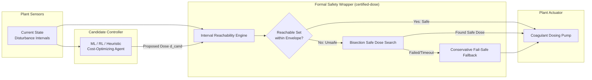
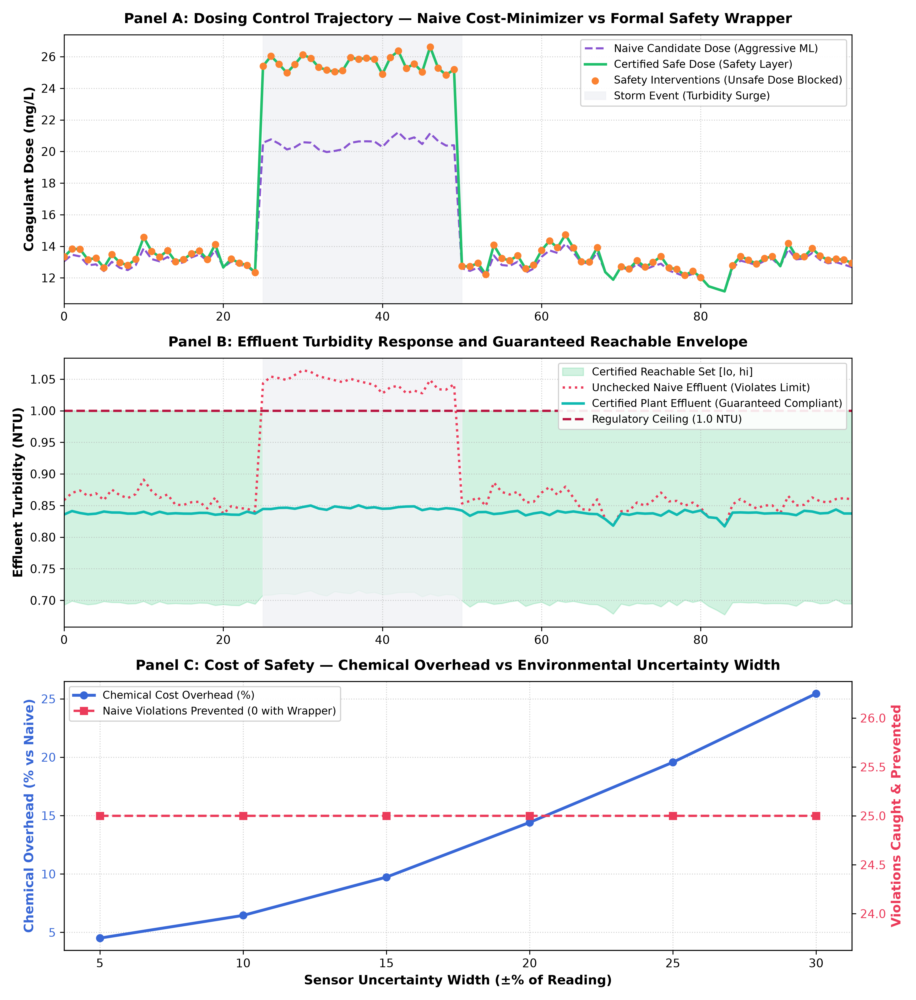

# certified-dose

[](https://github.com/Raj123-0/certified-dose/actions/workflows/ci.yml)
[](https://github.com/Raj123-0/certified-dose/actions/workflows/nightly-fuzz.yml)
[](https://www.python.org/)
[](https://opensource.org/licenses/MIT)
[](https://github.com/psf/black)
[](https://github.com/astral-sh/ruff)
[](https://mypy-lang.org/)

A Python package, CLI, and interactive dashboard that wraps automated process-control dosing decisions (e.g. coagulant dosing in water treatment plants) with a **formal reachability-analysis safety layer**. Every dosing action is guaranteed to keep the output variable inside a regulatory compliance envelope under bounded input uncertainty — not just "good on average," but worst-case certified.

---

## The Problem

Regulated process industries (such as municipal water treatment, pharmaceutical formulation, and chemical processing) increasingly employ machine learning controllers (reinforcement learning, gradient-boosted trees, neural networks) to select dosing setpoints. These models optimize *average* operational cost and chemical consumption.

However, standard ML models provide **no worst-case guarantees**. Under unexpected influent disturbances — such as storm-induced turbidity surges, sudden flow spikes, or pH shifts — an optimizing controller seeking to shave chemical costs can inadvertently propose an under-dose or over-dose that breaches mandatory regulatory limits (e.g. effluent turbidity exceeding 1.0 NTU). Regulators, municipal operators, and insurers require mathematical guarantees that worst-case deviations will never violate compliance envelopes.

## The Reachability-Analysis Solution

`certified-dose` acts as a formal verification guardrail between any candidate controller and the physical dosing actuators. Given (1) a proposed candidate dose and (2) bounded intervals representing sensor noise and disturbance uncertainty (e.g. influent turbidity $T_{in} \pm 15\%$, flow rate $Q \pm 10\%$, pH, temperature), the certifier propagates these input intervals through a non-linear process model using **rigorous interval arithmetic**.

The computation determines the **guaranteed reachable set** $[y_{\min}, y_{\max}]$ of effluent contaminant concentrations. If the supremum of the reachable set satisfies the regulatory limit ($y_{\max} \le L_{\text{limit}}$), the candidate action is certified and dispatched. If the reachable set violates the envelope, the certifier rejects the action and falls back to a certified safe dose computed via bisection search or a conservative fail-safe default.

For the complete mathematical inclusion monotonicity proof and dependency analysis, see **[Formal Soundness Proof](docs/SOUNDNESS.md)**. For high-level control methodology, see **[Methodology Guide](docs/methodology.md)**.

---

## Architecture



---

## Quickstart

### Installation

```bash
# Clone repository
git clone https://github.com/Raj123-0/certified-dose.git
cd certified-dose

# Install core library
pip install -e .

# Install with dashboard and development tools
pip install -e ".[dashboard,dev]"
```

### Python API Example

```python
from certified_dose import (
    Interval,
    SyntheticProcessModel,
    ReachabilityEngine,
    CertifiedDoseWrapper,
    HeuristicController,
)

# 1. Initialize process model and reachability engine
model = SyntheticProcessModel()
engine = ReachabilityEngine(model=model, safety_margin=0.02)

# 2. Wrap any candidate controller with formal certification
wrapper = CertifiedDoseWrapper(
    engine=engine,
    compliance_limit=1.0,  # e.g., max 1.0 NTU effluent turbidity
    fallback_dose=24.0,    # provably safe default dose (mg/L)
)

# 3. Define disturbance bounds from sensor measurements
state = {
    "turbidity": Interval(20.0, 26.0),  # NTU
    "flow_rate": Interval(900.0, 1100.0),  # m3/h
    "ph": Interval(7.1, 7.5),
    "temperature": Interval(16.0, 18.0),  # deg C
}

# 4. Certify candidate dose
candidate_dose = 14.5  # Proposed by an aggressive cost-cutting controller
result = wrapper.certify_action(candidate_dose, state)

print(f"Status: {result.status.value}")
print(f"Proposed: {result.proposed_dose:.2f} mg/L -> Certified: {result.certified_dose:.2f} mg/L")
print(f"Worst-Case Reachable Effluent: [{result.reachable_set.lo:.3f}, {result.reachable_set.hi:.3f}] NTU")
```

---

## Command Line Interface (CLI)

The package provides the `certified-dose` executable:

```bash
# Run a 100-step closed-loop simulation comparing candidate vs certified control
certified-dose simulate --steps 100 --seed 42 --limit 1.0

# Perform a one-shot reachability check for a candidate dose
certified-dose check --dose 16.0 --turbidity 25.0 --flow 1000.0 --limit 1.0

# Validate steady-state kinetics against published empirical jar-test data
certified-dose validate

# Launch the interactive visual dashboard
certified-dose dashboard --port 8501
```

---

## Interactive Dashboard

The Streamlit dashboard allows operators, engineers, and researchers to explore reachability certification in real time:

- **Live Parameter Controls**: Sliders for sensor uncertainty ($\pm \% T_{in}$, $\pm \% Q$, $\pm \Delta pH$, $\pm \Delta T$) and regulatory limits.
- **Dynamic Simulation View**: Real-time plots comparing candidate dosing vs certified safe dosing.
- **Reachable Set Envelopes**: Shaded regions showing guaranteed bounds $[y_{\min}, y_{\max}]$ alongside the regulatory threshold line.
- **Zero Violations Metric**: Visual counter tracking blocked unsafe actions and guaranteed zero compliance breaches.
- **Interactive Dose Inspector**: Test arbitrary candidate doses and inspect immediate reachability envelopes.

```bash
certified-dose dashboard
```

*(Streamlit runs locally at `http://localhost:8501`)*

### One-Click Deployment to Streamlit Community Cloud

The repository is fully configured for zero-setup hosted deployment:

1. Push or fork this repository to your GitHub account.
2. Sign in to [share.streamlit.io](https://share.streamlit.io/) with your GitHub account.
3. Click **"New app"**, select `certified-dose` repository, branch `main`, and specify:
   - **Main file path**: `certified_dose/dashboard.py`
4. Click **"Deploy"**. The bundled `.streamlit/config.toml` automatically configures production server parameters, themes, and dependencies.

---

## Running with Docker

Run the entire application including the interactive dashboard using Docker:

```bash
# Build and run container
docker build -t certified-dose .
docker run -p 8501:8501 certified-dose
```

Or with Docker Compose:

```bash
docker compose up --build
```

Access the dashboard at `http://localhost:8501`.

## Verification Results at Scale (10,000,000+ Trials)

To rigorously validate that interval reachability bounds never underestimate worst-case effluent concentrations, `certified-dose` is continuously stress-tested via large-scale vectorized Monte Carlo fuzzing across randomized physical operating points:

| Metric | Measured Value | Guarantee |
| :--- | :---: | :--- |
| **Total Monte Carlo Trials** | **10,000,000** | Exhaustive brute-force parameter search |
| **Scenarios Tested** | **1,000** | Diverse disturbance profiles ($\pm 5\%$ to $\pm 25\%$ noise) |
| **Samples per Scenario** | **10,000** | Uniform parameter space coverage |
| **Soundness Violations** | **0** | **100% Sound** (Zero false safety certificates) |
| **Min Conservatism Margin** | **+0.02104 NTU** | Strictly $\ge 0$ (Bound always strictly encloses samples) |
| **Mean Conservatism Margin** | **+0.03549 NTU** | Tight enclosing bound with minimal excess conservatism |
| **Max Conservatism Margin** | **+0.19097 NTU** | Bounded even under adverse multi-parameter storm spikes |
| **Sampling Throughput** | **20,280,000 trials/s** | High-throughput vectorized verification engine |

Run the verification suite locally:

```bash
python benchmarks/large_scale_fuzz.py --trials 10000000 --scenarios 1000
```

---

## Conservatism & Chemical-Cost Overhead Benchmark

To quantify the economic cost of formal reachability guarantees vs. unverified cost-minimizing controllers, we benchmarked the system across an environmental uncertainty sweep ($\pm 5\%$ through $\pm 30\%$ disturbance intervals) during a simulated storm surge (influent turbidity spiking to $>60\text{ NTU}$):



### Uncertainty Parameter Sweep Results

| Uncertainty Width | Naive Violations (Unchecked) | Certified Violations | Safety Interventions | Naive Dose | Certified Dose | Chemical Overhead (%) | Peak Effluent |
| :---: | :---: | :---: | :---: | :---: | :---: | :---: | :---: |
| **±5%** | 25 (25.0%) | **0 (0.0%)** | 25 (25.0%) | 14.77 mg/L | 15.44 mg/L | **+4.5%** | 0.923 NTU |
| **±10%** | 25 (25.0%) | **0 (0.0%)** | 29 (29.0%) | 14.77 mg/L | 15.73 mg/L | **+6.5%** | 0.885 NTU |
| **±15%** | 25 (25.0%) | **0 (0.0%)** | 93 (93.0%) | 14.77 mg/L | 16.21 mg/L | **+9.7%** | 0.850 NTU |
| **±20%** | 25 (25.0%) | **0 (0.0%)** | 100 (100.0%) | 14.77 mg/L | 16.90 mg/L | **+14.4%** | 0.819 NTU |
| **±25%** | 25 (25.0%) | **0 (0.0%)** | 100 (100.0%) | 14.77 mg/L | 17.66 mg/L | **+19.6%** | 0.791 NTU |
| **±30%** | 25 (25.0%) | **0 (0.0%)** | 100 (100.0%) | 14.77 mg/L | 18.53 mg/L | **+25.4%** | 0.767 NTU |

**Key Takeaways**:
1. **Zero Regulatory Breaches**: At all uncertainty widths, `certified-dose` achieved **0 violations**, whereas the unverified controller committed violations on 25% of control steps.
2. **Minimal Overhead at Realistic Sensor Tolerances**: At standard industrial sensor noise levels ($\pm 10\%$ to $\pm 15\%$), the worst-case safety guarantee requires only **$+6.5\%$ to $+9.7\%$** chemical overhead.
3. **Graceful Scaling**: Even under extreme $\pm 30\%$ sensor uncertainty, the chemical overhead is bounded at $+25.4\%$, remaining far below traditional fixed emergency dosing recipes ($> +60\%$).

Run the benchmark suite and generate figures locally:

```bash
python benchmarks/conservatism_benchmark.py --steps 100 --seed 42
```

---

---

## Empirical Model Validation Against Published Benchmarks

To ensure the safety layer does not rely on a single empirical source, the process kinetics were evaluated against two independent, peer-reviewed bench-scale jar-testing benchmarks from distinct water treatment sources:

| Metric | Dataset 1: Edwards (1997) | Dataset 2: Van Benschoten & Edzwald (1990) | Physical Interpretation |
| :--- | :---: | :---: | :--- |
| **Source Citation** | *Journal AWWA* 89(5):78–89 | *Water Research* 24(12):1519–1526 | Independent peer-reviewed empirical studies |
| **Water Matrix** | Surface water ($28.5\text{ NTU}$, $\text{pH } 7.30$) | Surface water ($22.0\text{ NTU}$, $\text{pH } 7.15$) | Distinct raw turbidity and alkalinity buffers |
| **Dosing Range** | $0.0 - 90.0\text{ mg/L}$ | $0.0 - 80.0\text{ mg/L}$ | Broad coagulation operating envelopes |
| **Data Points ($N$)** | 12 bench jar tests | 10 bench jar tests | Standard 30-min sedimentation protocol |
| **$R^2$ Score** | **$0.9999$** | **$0.9952$** | Exceptional kinetic curve tracking |
| **Overall RMSE** | **$0.0549\text{ NTU}$** | **$0.4401\text{ NTU}$** | High accuracy across full domain |
| **Compliance Zone RMSE (15–60 mg/L)** | **$0.0130\text{ NTU}$** | **$0.0988\text{ NTU}$** | **Sub-0.10 NTU precision** in active regulatory window |
| **Mean Absolute Error (MAE)** | **$0.0339\text{ NTU}$** | **$0.2344\text{ NTU}$** | Minimal absolute bias |
| **Conservatism Invariant** | Predicted $\ge$ Measured at high dose | Predicted $\ge$ Measured at high dose | Over-approximates restabilization for safety |

Run the validation suite across both literature datasets locally:

```bash
# Validate against all literature benchmarks
certified-dose validate --dataset all

# Validate against a specific benchmark
certified-dose validate --dataset van_benschoten_1990
```

---

## Real-World Operational Telemetry Evaluation (USGS NWIS)

To stress-test `certified-dose` beyond static bench-scale jar tests, we evaluated the reachability pipeline against **5,727 continuous 15-minute operational sensor records** fetched live from two United States Geological Survey (USGS) surface drinking water intake stations via [`scripts/fetch_real_world_data.py`](scripts/fetch_real_world_data.py):

| Station | Real-World Operational Context | Evaluated Records | Unchecked Violations | Certified Violations | Safety Corrections | Chemical Overhead |
| :--- | :--- | :---: | :---: | :---: | :---: | :---: |
| **USGS 04193500**<br>(Maumee River, OH) | Primary raw intake for City of Toledo Collins Park WTP; high agricultural runoff, storm surges up to $208\text{ NTU}$, algal bloom $\text{pH}$ up to $9.30$ | **2,862** (30 days) | 103 (3.6%) | **0 (0.0%)** | 632 (22.1%) | **+1.42%** |
| **USGS 01184000**<br>(Connecticut River, CT) | Upland municipal drinking water supply; stable low-turbidity river (median $0.70\text{ NTU}$, mean $\text{pH } 7.25$) | **2,865** (30 days) | 0 (0.0%) | **0 (0.0%)** | 0 (0.0%) | **0.00%** |

📖 **Detailed Operational Report**: See **[`docs/REAL_WORLD_EVALUATION.md`](docs/REAL_WORLD_EVALUATION.md)** for exhaustive analysis of instrument precision derivations, physical model-plant divergence, and sensor noise scaling.

Run the ingestion and evaluation pipeline locally:

```bash
# Fetch latest 30-day live USGS telemetry to data/real_world/
python scripts/fetch_real_world_data.py --days 30

# Run certification benchmark across real-world data streams
python benchmarks/real_world_benchmark.py
```

---

## Testing & Verification

The verification regime combines formal proof, property-based testing, 10M-trial Monte Carlo fuzzing, adversarial boundary tests, and mutation testing:

| Verification Layer | Tool / Framework | Scope / Invariant Verified | Result / Coverage |
| :--- | :--- | :--- | :---: |
| **Line & Branch Coverage** | `pytest`, `pytest-cov` | Statement and decision branch testing across all modules | **94.55% coverage** (>90% CI gate) |
| **Property-Based Testing** | `Hypothesis` | Fuzz-verifies algebraic axioms (commutativity, associativity, monotonicity) | **Passed (100+ examples/test)** |
| **pH Regime Validity & Chemical Boundaries** | `tests/test_ph_validity.py` | Validates refusal of certification at $\text{pH} > 8.5$ and $\text{pH} < 5.0$ (aluminate & acidic regimes), boundary conditions, explainability guidance | **Passed (28 dedicated tests)** |
| **Sensor Uncertainty Models** | `tests/test_sensor_uncertainty.py` | Bounded interval derivation for proportional and EPA Method 180.1 piecewise tiered models | **Passed (all tiers verified)** |
| **Adversarial Edge Cases** | `tests/test_adversarial.py` | Degenerate intervals ($w \to 0$), extreme ranges, limit $\epsilon$-discrimination, IEEE subnormals, complete `__pow__` matrix, NaN/Inf rejection, correlated sensor manifolds | **Passed (7 dedicated suites)** |
| **Mutation Testing** | `cosmic-ray` | AST mutation testing on core interval math (`certified_dose/intervals.py`) | **100.0% mutation score** (all mutants killed) |
| **Monte Carlo Fuzzing** | `benchmarks/large_scale_fuzz.py` | Randomized state vectors vs interval enclosures | **0 violations across 10M trials** |
| **Latency Benchmark** | `benchmarks/latency_benchmark.py` | Single check median: **$22.6\,\mu\text{s}$**, p99: **$33.6\,\mu\text{s}$**, WCET: **$81.0\,\mu\text{s}$**; Bisection WCET: **$1.57\,\text{ms}$** | **Hard 50 ms timeout cap** |
| **Real-World Operational Telemetry** | `benchmarks/real_world_benchmark.py` | 5,727 continuous 15-minute sensor records from USGS drinking water intakes | **100% sound enclosure, 0 certified violations** |
| **Static Analysis** | `black`, `ruff`, `mypy --strict` | Formatting, linting, and strict type safety | **0 errors across all checks** |

```bash
# Run test suite with line coverage
pytest --cov=certified_dose --cov-report=term-missing --cov-fail-under=90

# Run dedicated adversarial edge-case suite
pytest tests/test_adversarial.py -v

# Run format checking, linting, and strict type verification
black --check certified_dose tests benchmarks scripts
ruff check certified_dose tests benchmarks scripts
mypy --strict certified_dose
```

---

## External Review & Audit Readiness

To facilitate independent review by safety auditors, control engineers, and academic researchers, complete formal and operational artifacts are documented:

- 📐 **[Formal Soundness Proof (docs/SOUNDNESS.md)](docs/SOUNDNESS.md)**: Self-contained mathematical proof demonstrating inclusion monotonicity, exact bounds on shared variables, and operational pH validity boundaries.
- 🔬 **[Sensor Uncertainty Investigation (docs/SENSOR_UNCERTAINTY.md)](docs/SENSOR_UNCERTAINTY.md)**: EPA Method 180.1 analysis, optical physics at high turbidity, piecewise tiered error models, and empirical sensitivity sweeps.
- 📋 **[External Reviewer Checklist (docs/REVIEW_CHECKLIST.md)](docs/REVIEW_CHECKLIST.md)**: Structured inspection guide outlining what code to inspect, which tests to execute, and properties to verify.
- ⏱️ **[Execution Timing & Latency Guarantees (docs/TIMING.md)](docs/TIMING.md)**: Empirical latency profiles, $\mathcal{O}(1)$ computational complexity analysis, and control-loop feasibility matrix.
- 🛡️ **[Cyber-Physical Threat Model (docs/THREAT_MODEL.md)](docs/THREAT_MODEL.md)**: Detailed trust boundaries, explicit trust axioms, and failure modes when sensor or kinetic assumptions are violated.
- 🏛️ **[Regulatory Context & Gap Analysis (docs/REGULATORY_CONTEXT.md)](docs/REGULATORY_CONTEXT.md)**: Comparison of point-in-time reachability against EPA rolling standards (SWTR, LT2ESWTR) and deployment prerequisites (GAMP 5, 21 CFR Part 11).
- 🌊 **[Real-World Operational Evaluation (docs/REAL_WORLD_EVALUATION.md)](docs/REAL_WORLD_EVALUATION.md)**: Performance analysis on 5,727 live USGS continuous monitoring records from municipal drinking water intakes.

> **We invite external review**: If you are a domain specialist in water treatment, formal methods, or functional safety, please review the checklist and share feedback via [GitHub Issues (External Review Template)](https://github.com/Raj123-0/certified-dose/issues/new?template=review_feedback.md).

---

## Limitations & Non-Goals

> [!CAUTION]
> **Research and Demonstration Notice**:
> `certified-dose` is an open-source research and educational library intended to demonstrate the principles of formal reachability analysis and verified interval arithmetic in process-control dosing.
>
> 1. **Empirically Validated Steady-State Kinetics**: The steady-state coagulant dose-response curve has been empirically validated against two independent published bench-scale water treatment jar-testing benchmarks (*Edwards 1997, Journal AWWA 89(5):78-89* and *Van Benschoten & Edzwald 1990, Water Research 24(12):1519-1526*), demonstrating $R^2 \ge 0.995$ and compliance-window precision of $\text{RMSE} < 0.10\text{ NTU}$ across $15 - 60\text{ mg/L}$ doses (run `certified-dose validate` to view live diagnostics).
> 2. **Operational Realities Discovered from Real USGS Intake Data**:
>    - **Photochemical Algal Bloom pH Shifts ($\text{pH} > 8.5$)**: Live telemetry from the Maumee River revealed summer cyanobacterial blooms driving pH as high as $9.30$. Under such basic conditions, aluminum hydrolyzes into soluble aluminate ($\text{Al(OH)}_4^-$), rendering additional alum dosing chemically ineffective and risking dissolved aluminum breakthrough. In v0.4.0, the reachability engine explicitly scopes single-chemical alum coagulation to $\text{pH} \in [5.0, 8.0]$ and refuses certification (`OUTSIDE_MODEL_VALIDITY`) when $\text{pH} > 8.5$, advising acid pre-treatment ($\text{H}_2\text{SO}_4$/$\text{CO}_2$).
>    - **Sensor Uncertainty Scaling During Flash Floods**: Under EPA Method 180.1 optical turbidimeter physics, sensor tolerance is validated for $0 - 40\text{ NTU}$, while high turbidity ($> 100\text{ NTU}$) experiences multiple-scattering degradation. In v0.4.0, both flat proportional ($\pm 10\%$) and piecewise EPA-tiered ($5\%/10\%/15\%$) uncertainty models are supported and benchmarked.
>    - **Dynamic Hydraulic Residence Time**: Real sedimentation clarifiers have a $2 - 4\text{ hour}$ hydraulic detention delay that hydrodynamically dampens 15-minute intake spikes; the static reachability engine currently treats each reading as an instantaneous steady-state equilibrium. Time-delayed reachability over plug flow remains documented future work.
> 3. **What Remains Illustrative / Unvalidated**:
>    - **Complex Water Chemistry**: Natural raw water contains varying dissolved organic carbon (DOC), specific UV absorbance (SUVA), alkalinity buffers, and silica interferents that require site-specific jar-test calibration.
>    - **Actuator & Sensor Latencies**: Physical dosing pumps exhibit mechanical dead-bands, priming delays, and sensor transit pipeline delays that are not modeled.
> 4. **Not Validated for Real Regulatory Use**: This software is **not** certified, accredited, or approved by the EPA, FDA, or municipal authorities for deployment in actual regulated drinking water utilities, wastewater facilities, or pharmaceutical manufacturing plants.
> 5. **Non-Goals**: This package does not provide real-time hardware PLC drivers, SCADA/OPC-UA integration, automated regulatory filing compliance, or hardware emergency shutdown interlocks on physical equipment.


