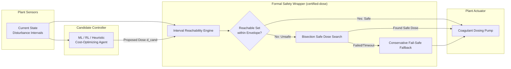

# certified-dose

[](https://github.com/Raj123-0/certified-dose/actions/workflows/ci.yml)
[](https://www.python.org/)
[](https://opensource.org/licenses/MIT)
[](https://github.com/psf/black)
[](https://github.com/astral-sh/ruff)
[](https://mypy-lang.org/)

A Python package, CLI, and interactive dashboard that wraps automated process-control dosing decisions (e.g. coagulant dosing in water treatment plants) with a **formal reachability-analysis safety layer**. Every dosing action is guaranteed to keep the output variable inside a regulatory compliance envelope under bounded input uncertainty — not just "good on average," but worst-case certified.

---

## The Problem

Regulated process industries (such as municipal water treatment, pharmaceutical formulation, and chemical processing) increasingly employ machine learning controllers (reinforcement learning, gradient-boosted trees, neural networks) to select dosing setpoints. These models optimize *average* operational cost and chemical consumption.

However, standard ML models provide **no worst-case guarantees**. Under unexpected influent disturbances — such as storm-induced turbidity surges, sudden flow spikes, or pH shifts — an optimizing controller seeking to shave chemical costs can inadvertently propose an under-dose or over-dose that breaches mandatory regulatory limits (e.g. effluent turbidity exceeding 1.0 NTU). Regulators, municipal operators, and insurers require mathematical guarantees that worst-case deviations will never violate compliance envelopes.

## The Reachability-Analysis Solution

`certified-dose` acts as a formal verification guardrail between any candidate controller and the physical dosing actuators. Given (1) a proposed candidate dose and (2) bounded intervals representing sensor noise and disturbance uncertainty (e.g. influent turbidity $T_{in} \pm 15\%$, flow rate $Q \pm 10\%$, pH, temperature), the certifier propagates these input intervals through a non-linear process model using **rigorous interval arithmetic**.

The computation determines the **guaranteed reachable set** $[y_{\min}, y_{\max}]$ of effluent contaminant concentrations. If the supremum of the reachable set satisfies the regulatory limit ($y_{\max} \le L_{limit}$), the candidate action is certified and dispatched. If the reachable set violates the envelope, the certifier rejects the action and falls back to a certified safe dose computed via bisection search or a conservative fail-safe default.

---

## Architecture



---

## Quickstart

### Installation

```bash
# Clone repository
git clone https://github.com/Raj123-0/certified-dose.git
cd certified-dose

# Install core library
pip install -e .

# Install with dashboard and development tools
pip install -e ".[dashboard,dev]"
```

### Python API Example

```python
from certified_dose import (
    Interval,
    SyntheticProcessModel,
    ReachabilityEngine,
    CertifiedDoseWrapper,
    HeuristicController,
)

# 1. Initialize process model and reachability engine
model = SyntheticProcessModel()
engine = ReachabilityEngine(model=model, safety_margin=0.02)

# 2. Wrap any candidate controller with formal certification
wrapper = CertifiedDoseWrapper(
    engine=engine,
    compliance_limit=1.0,  # e.g., max 1.0 NTU effluent turbidity
    fallback_dose=24.0,    # provably safe default dose (mg/L)
)

# 3. Define disturbance bounds from sensor measurements
state = {
    "turbidity": Interval(20.0, 26.0),  # NTU
    "flow_rate": Interval(900.0, 1100.0),  # m3/h
    "ph": Interval(7.1, 7.5),
    "temperature": Interval(16.0, 18.0),  # deg C
}

# 4. Certify candidate dose
candidate_dose = 14.5  # Proposed by an aggressive cost-cutting controller
result = wrapper.certify_action(candidate_dose, state)

print(f"Status: {result.status.value}")
print(f"Proposed: {result.proposed_dose:.2f} mg/L -> Certified: {result.certified_dose:.2f} mg/L")
print(f"Worst-Case Reachable Effluent: [{result.reachable_set.lo:.3f}, {result.reachable_set.hi:.3f}] NTU")
```

---

## Command Line Interface (CLI)

The package provides the `certified-dose` executable:

```bash
# Run a 100-step closed-loop simulation comparing candidate vs certified control
certified-dose simulate --steps 100 --seed 42 --limit 1.0

# Perform a one-shot reachability check for a candidate dose
certified-dose check --dose 16.0 --turbidity 25.0 --flow 1000.0 --limit 1.0

# Launch the interactive visual dashboard
certified-dose dashboard --port 8501
```

---

## Interactive Dashboard

The Streamlit dashboard allows operators, engineers, and researchers to explore reachability certification in real time:

- **Live Parameter Controls**: Sliders for sensor uncertainty ($\pm \% T_{in}$, $\pm \% Q$, $\pm \Delta pH$, $\pm \Delta T$) and regulatory limits.
- **Dynamic Simulation View**: Real-time plots comparing candidate dosing vs certified safe dosing.
- **Reachable Set Envelopes**: Shaded regions showing guaranteed bounds $[y_{\min}, y_{\max}]$ alongside the regulatory threshold line.
- **Zero Violations Metric**: Visual counter tracking blocked unsafe actions and guaranteed zero compliance breaches.
- **Interactive Dose Inspector**: Test arbitrary candidate doses and inspect immediate reachability envelopes.

```bash
certified-dose dashboard
```

*(Streamlit runs locally at `http://localhost:8501`)*

---

## Running with Docker

Run the entire application including the interactive dashboard using Docker:

```bash
# Build and run container
docker build -t certified-dose .
docker run -p 8501:8501 certified-dose
```

Or with Docker Compose:

```bash
docker compose up --build
```

Access the dashboard at `http://localhost:8501`.

---

## Testing & Verification

The test suite includes property-based tests (Hypothesis), Monte Carlo fuzzing against brute-force sampling, unit tests, and closed-loop end-to-end scenarios:

```bash
# Run test suite with line coverage
pytest --cov=certified_dose --cov-report=term-missing --cov-fail-under=90

# Format checking and linting
black --check certified_dose tests
ruff check certified_dose tests

# Strict type checking
mypy certified_dose
```

---

## Limitations & Non-Goals

> [!CAUTION]
> **Research and Demonstration Notice**:
> `certified-dose` is a research and educational prototype intended to demonstrate the principles of formal reachability analysis and interval arithmetic in process-control dosing.
>
> 1. **Synthetic Process Model**: The wastewater coagulation model included in this package is an illustrative, synthetic non-linear formulation inspired by real-world jar-testing curves. It has **not** been calibrated or validated against physical chemical reactors, sensor lag dynamics, or specific industrial effluent compositions.
> 2. **Not Validated for Real Regulatory Use**: This software is **not** certified or approved for use in actual regulated drinking water treatment plants, municipal wastewater facilities, or pharmaceutical manufacturing plants.
> 3. **Non-Goals**: This package does not provide real-time hardware PLC drivers, SCADA integration, automated regulatory filing compliance, or emergency shutdown guarantees on physical equipment.
