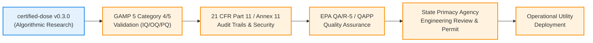

# Regulatory Context and Compliance Gap Analysis

> [!CAUTION]
> **Regulatory Disclaimer and Non-Claim Notice**:
> `certified-dose` is an open-source research and educational prototype demonstrating the application of formal methods (interval reachability analysis) to process control.
>
> **This software is not certified, accredited, approved, or validated by the U.S. Environmental Protection Agency (EPA), state primacy agencies, the U.S. Food and Drug Administration (FDA), or any international drinking water authority.**
>
> It does not constitute a certified compliance tool, and its use does not satisfy regulatory monitoring, reporting, or control obligations under the Safe Drinking Water Act (SDWA), Clean Water Act (CWA), or Current Good Manufacturing Practice (cGMP).

---

## 1. Overview of Applicable Drinking Water Turbidity Regulations

In municipal and industrial water treatment, effluent turbidity is not merely an aesthetic metric; it serves as a primary surrogate indicator for microbial pathogens (*Cryptosporidium* oocysts, *Giardia* cysts, and enteric viruses) that resist chemical disinfection when shielded within suspended colloidal particulates.

The primary U.S. federal regulatory frameworks governing drinking water turbidity include:

### A. Surface Water Treatment Rule (SWTR) & Interim Enhanced SWTR (IESWTR)
- **40 CFR § 141.73**: Mandates conventional or direct filtration water treatment plants to treat surface water sources.
- **Combined Filter Effluent (CFE)**: Turbidity must be $\le 0.3\text{ NTU}$ in at least 95% of measurements taken each month.
- **Maximum Ceiling**: CFE turbidity must never exceed **$1.0\text{ NTU}$** at any time.

### B. Long Term 2 Enhanced Surface Water Treatment Rule (LT2ESWTR)
- **40 CFR § 141 Subpart W**: Requires individual filter effluent (IFE) monitoring every 15 minutes.
- Triggers mandatory plant investigations and filter assessments if any individual filter exceeds:
  - $0.5\text{ NTU}$ after 4 hours of continuous operation.
  - $1.0\text{ NTU}$ in two consecutive 15-minute readings.

### C. Stage 1 & Stage 2 Disinfectants and Disinfection Byproducts Rules (D/DBPR)
- **40 CFR § 141.135**: Mandates **Enhanced Coagulation** for surface water systems with conventional treatment.
- Utilities must dose coagulant to achieve specified Total Organic Carbon (TOC) removal percentages (typically $15\% - 50\%$ depending on raw water TOC and alkalinity) to minimize the formation of carcinogenic trihalomethanes (THMs) and haloacetic acids (HAAs) prior to primary disinfection.

---

## 2. Mathematical Reachability vs. Regulatory Rolling Standards

A central conceptual question is how the mathematical safety guarantees provided by `certified-dose` compare against the rolling statistical standards enforced by environmental regulators:

| Dimension | Point-in-Time Reachability Certification (`certified-dose`) | Regulatory Standard (EPA SWTR / LT2ESWTR) |
| :--- | :--- | :--- |
| **Mathematical Basis** | Formal worst-case interval propagation: $\sup_{\theta \in \Theta} f(d, \theta) \le L_{\text{limit}}$ | Empirical rolling percentile: $P(\text{Effluent} \le 0.3\text{ NTU}) \ge 0.95$ over 30 days |
| **Temporal Scope** | Instantaneous per control step ($1\,\text{s} - 60\,\text{s}$ cycle) | Aggregated historical record across monthly sampling ($N \approx 2,880$ readings) |
| **Sensor Uncertainty** | Explicitly bounded: evaluates reachability across $[\underline{\theta}, \overline{\theta}]$ | Implicit: treats physical sensor readings as exact point truths |
| **Tail-Risk Tolerance** | **Zero tolerance**: candidate dose is rejected if even a single point in the uncertainty box breaches the limit | **Tolerates up to 5% excursions**: up to 36 hours of $>0.3\text{ NTU}$ water permitted per month |
| **Source of Truth** | Analytical process model evaluated through interval arithmetic | Physical online turbidimeter analyzer reading at compliance tap |

### Where Reachability Certification is Stronger

1. **Elimination of Pathogen Breakthrough Windows**:
   Rolling percentile standards allow a facility to be 100% compliant while discharging elevated turbidity for up to 36 hours per month. During a major storm runoff event, an under-dosing excursion lasting only 20 minutes can deliver millions of infectious *Cryptosporidium* oocysts into clearwells. `certified-dose` rejects any dosing setpoint that cannot be certified safe at every single control step.

2. **Sensor Measurement Awareness**:
   Standard SCADA loops act on single sensor values, ignoring calibration drift and noise. `certified-dose` forces explicit modeling of sensor uncertainty: if turbidity sensor noise is $\pm 15\%$, the certifier checks the worst-case scenario at the upper boundary.

### Where Reachability Certification is Weaker or Limited

1. **Model Dependence vs. Physical Empirical Reality**:
   Regulators penalize what actually exits the filter, not what a model predicts. If the mathematical model fails to account for unmodeled physical phenomena (floc shear, filter ripening spikes, cold-water kinetic slowing, or coagulant batch degradation), the safety layer may issue a "valid" mathematical certificate while the physical plant breaches regulatory compliance.

2. **Detention Time and Hydraulic Dynamics**:
   Physical water treatment plants are not instantaneous algebraic functions; they are distributed hydraulic networks with flocculation and sedimentation detention times ranging from 30 minutes to 4 hours. A point-in-time algebraic certifier must be coupled with dynamic state estimators to account for hydraulic residence delays.

---

## 3. The Regulatory Deployment Gap

Before any algorithmic safety layer or automated dosing wrapper could be deployed in an operational, permitted drinking water or wastewater facility, several mandatory regulatory and engineering validation milestones must be completed:



### Specific Requirements for Permitted Deployment:

### 1. GAMP 5 & Software Quality Lifecycle
- **Categorization**: Under ISPE GAMP 5, `certified-dose` is categorized as Category 4 (Configured Software) or Category 5 (Custom Software).
- **Required Artifacts**:
  - User Requirements Specification (URS) and Functional Specification (FS).
  - Traceability Matrix linking every regulatory safety requirement to unit, integration, and stress tests.
  - Installation Qualification (IQ), Operational Qualification (OQ), and Performance Qualification (PQ) executed on target industrial hardware.

### 2. FDA 21 CFR Part 11 / EU Annex 11 (Audit Integrity)
If deployed in pharmaceutical water for injection (WFI) or biotechnology facilities:
- **Tamper-Evident Audit Logging**: Every parameter adjustment, uncertainty setting change, and certifier intervention must be logged to a write-once, tamper-evident audit repository.
- **Role-Based Access Control (RBAC)**: Strict segregation of duties between plant operators, process engineers, and compliance auditors.
- **Electronic Signatures**: Formal authorization required for model parameter updates or compliance limit alterations.

### 3. EPA Quality Assurance Project Plan (QAPP) & State Primacy Review
- **EPA QA/R-5 & QA/G-5 Compliance**: A documented Quality Management Plan governing data quality objectives (DQOs), calibration frequencies, and measurement uncertainty bounds.
- **Ten States Standards (GLUMRB)**: State environmental departments (e.g., California DDW, Texas TCEQ, NYSDOH) require certified Professional Engineer (P.E.) stamped plans, jar-test verification protocols, and fail-safe hardware overrides before software control loops can command chemical feeds.

### 4. Functional Safety (IEC 61508 / IEC 61511)
- Chemical dosing safety systems with potential public health impact must undergo Safety Integrity Level (SIL) hazard and operability studies (HAZOP).
- Software safety layers serve as Layer of Protection Analysis (LOPA) mitigations, but cannot replace hardwired Safety Instrumented Systems (SIS) with independent sensor loops and emergency divert valves.

---

## 4. Recommended Industry Adoption Path

To bridge the gap between academic formal methods and regulated utility operations, `certified-dose` should follow a phased operational adoption lifecycle:

```
[Phase 1: Shadow / Advisory Mode]
      │
      ▼
  Run safety wrapper in parallel with human operators.
  Log all would-be interventions without commanding dosing pumps.
  Compare predictions with downstream physical analyzers.
      │
      ▼
[Phase 2: Bounded Supervisory Setpoint Trimming]
      │
      ▼
  Allow safety wrapper to clamp candidate AI/optimization setpoints
  within narrow, pre-approved engineering rate-of-change bands (e.g., ±2 mg/L/hr).
      │
      ▼
[Phase 3: Formal Closed-Loop Safety Layer]
      │
      ▼
  Full closed-loop certification backed by GAMP 5 IQ/OQ/PQ validation,
  triple-redundant sensor voting (2oo3), and independent hardwired SIS interlocks.
```

---

## 5. Summary

`certified-dose` demonstrates that **formal mathematical reachability analysis is computationally feasible for real-time process dosing** (sub-millisecond evaluation times). However, algorithmic correctness within a software boundary is only one component of cyber-physical plant safety. Deploying such algorithms in regulated environments requires comprehensive model validation, sensor redundancy, data integrity logging, and rigorous adherence to established environmental and functional safety standards.
