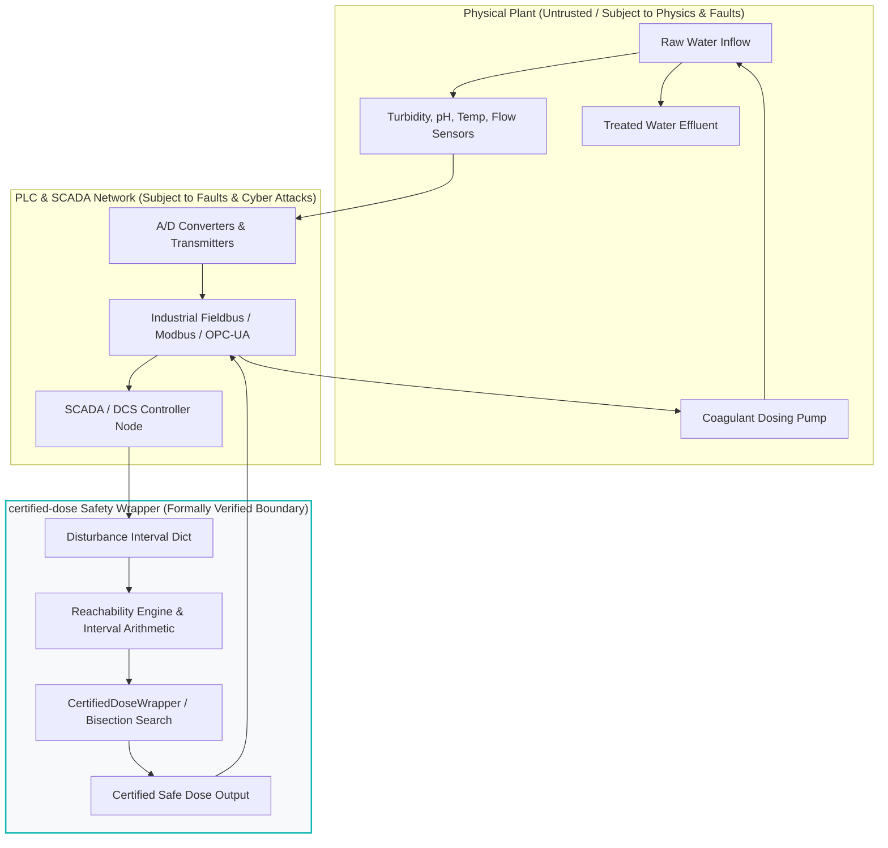

# Threat Model and Cyber-Physical Trust Assumptions

## 1. Scope and Purpose

`certified-dose` provides a **formal mathematical reachability layer** for chemical dosing in automated process control. It mathematically guarantees that *given* an input disturbance uncertainty envelope $\Theta = \prod_i [\underline{\theta}_i, \overline{\theta}_i]$ and a kinetic process model $f(d, \theta)$, the worst-case reachable effluent concentration $\sup_{\theta \in \Theta} f(d, \theta)$ will not exceed the regulatory limit $L_{\text{limit}}$.

However, **mathematical proofs are conditional on physical and systemic axioms**. If the assumptions underlying the proof are violated in the physical plant, the safety certificate becomes invalid.

This document explicitly defines:
1. What the software assumes is trustworthy (the trust boundary).
2. The specific failure modes that occur when each assumption is breached.
3. Why this is an algorithmic boundary, not a cryptographic or hardware redundancy solution.

---

## 2. The Cyber-Physical Trust Boundary

The diagram below illustrates the software trust boundary and where `certified-dose` operates relative to sensors, actuators, and networks:

---

## 3. Explicit Trust Assumptions

The mathematical safety guarantees of `certified-dose` rest on five core assumptions:

### Assumption 1: Sensor Interval Inclosure
**Assumption**: The true, instantaneous physical disturbance state $\theta^{\star} = (T_{\text{in}}^{\star}, Q^{\star}, \text{pH}^{\star}, T^{\star})$ is strictly contained within the interval bounds passed to the certifier:
$$\theta^{\star} \in [\underline{\theta}, \overline{\theta}]$$
The certifier assumes that sensor calibration bounds (e.g. measured value $\pm 15\%$) fully account for sensor noise, measurement bias, and digitization error.

### Assumption 2: Process Model Kinetic Boundedness
**Assumption**: The kinetic equation $f(d, \theta)$ conservative over-approximates the actual physical-chemical effluent response of the plant:
$$y_{\text{plant}}(d, \theta) \le f(d, \theta) + \delta_{\text{margin}}$$
The certifier assumes that unmodeled physical dynamics (e.g., flocculator spatial dead zones, temperature-dependent viscosity shifts, mixing turbulence) are dominated by the model's structural conservatism and the additive safety margin ($\delta_{\text{margin}} = 0.02\text{ NTU}$).

### Assumption 3: Actuator Setpoint Tracking
**Assumption**: The physical dosing pump delivers an actual applied chemical dose $d^{\star}$ that conforms to the commanded certified dose $d_{\text{cert}}$ within a known bounded error $\Delta d$:
$$d^{\star} \in [d_{\text{cert}} - \Delta d, d_{\text{cert}} + \Delta d]$$

### Assumption 4: Deterministic Arithmetic & Execution Environment
**Assumption**: The runtime environment (Python interpreter, underlying OS kernel, CPU) deterministically executes IEEE 754 floating-point arithmetic without hardware bit flips (e.g., cosmic ray upsets), memory corruption, or thread race conditions.

### Assumption 5: Uncompromised Telemetry and Control Bus
**Assumption**: The digital communication channels connecting the sensors, the certifier, and the actuator pumps have not been compromised by malicious actors or unauthorized firmware modifications.

---

## 4. Failure Modes Under Assumption Violations

If any of the trust assumptions above are violated in real-world deployment, the formal guarantee degrades or collapses as follows:

| Violated Assumption | Physical Hazard Scenario | System Impact | Severity |
| :--- | :--- | :--- | :---: |
| **A1: Sensor Bounds** | Optical lens fouling or zero-drift causes a turbidity sensor to report $15 \pm 2\text{ NTU}$ while true influent is $85\text{ NTU}$ during a flash storm. | **False Certificate**: The certifier proves safety for $15\text{ NTU}$ and accepts a low dose ($12\text{ mg/L}$). The under-dosed plant discharges non-compliant effluent ($>1.0\text{ NTU}$). | **Critical** |
| **A1: Sensor Bounds** | Broken RTD temperature wire floats to maximum scale ($50^\circ\text{C}$). | **Conservatism Inversion**: Certifier assumes warm water (fast kinetics), underestimating required dose for freezing water. | **Critical** |
| **A2: Process Model** | Sudden raw water intrusion of Dissolved Organic Carbon (DOC/NOM) or industrial chelation agents increases coagulant demand by $300\%$. | **Model-Plant Mismatch**: The synthetic kinetics underestimate the coagulant requirement. The true settled effluent exceeds the predicted upper bound. | **Critical** |
| **A3: Actuator Tracking** | Air bubble entrapment or diaphragm rupture causes dosing pump to stroke without delivering chemical. | **Actuator Starvation**: Commanded dose is certified safe, but physical delivery is $0\text{ mg/L}$. | **Critical** |
| **A4: Compute Integrity** | Undetected RAM bit flip corrupts an interval bound or IEEE NaN comparison. | **Fail-Safe Breach**: Unhandled memory error. (Mitigated by Python exception boundary, which defaults to `fallback_dose`). | **Moderate** |
| **A5: Cyber Manipulation** | Adversary injects false sensor telemetry onto the industrial Ethernet (e.g., Modbus spoofing). | **Garbage-In, Certified-Out**: The algorithm guarantees compliance relative to the inputs it receives; it cannot detect fraudulent inputs. | **Critical** |

---

## 5. Architectural Mitigations for Production Deployments

Because `certified-dose` is a mathematical safety layer and **not** a hardware safety instrumented system (SIS), real-world plant deployments require defense-in-depth:

1. **Multi-Sensor Voting (TMR)**:
   Never feed a single sensor into the certifier. Deploy triple-redundant sensors with 2-out-of-3 (2oo3) median voting and sensor disagreement alarms. If sensors diverge beyond tolerance, widen the disturbance interval to span the envelope of all sensors.

2. **Plausibility & Rate-of-Change Sanity Filtering**:
   Pre-filter sensor data before constructing intervals. Discard unphysical rates of change (e.g., water temperature shifting by $10^\circ\text{C}$ in 1 second) and trigger safe fallback.

3. **Actuator Feedback Verification**:
   Pair chemical dosing pumps with downstream Coriolis mass flow meters to verify that the delivered physical chemical mass matches the commanded setpoint.

4. **Hardwired Physical Interlocks**:
   Maintain an independent, hardwired effluent monitoring station with an automated divert valve that bypasses non-compliant water to holding ponds independently of all software controllers.

5. **Regular Jar-Test Model Recalibration**:
   Plant operators must run regular bench-scale jar tests across seasons to re-estimate kinetic parameters ($c_1, c_2, \text{pH}_{\text{opt}}$) against shifting raw water matrices.

---

## 6. Non-Cryptographic and Non-Regulatory Disclaimer

> [!CAUTION]
> - `certified-dose` **does not provide cryptographic data authentication, sensor attestation, or intrusion detection**. It assumes inputs provided to its API are genuine.
> - `certified-dose` **is not certified under IEC 61508 (SIL), ISO 13849, or EPA 40 CFR 141 Safe Drinking Water Act**.
> - It is an algorithmic safety layer intended to be embedded within an engineered, defense-in-depth automation architecture.
