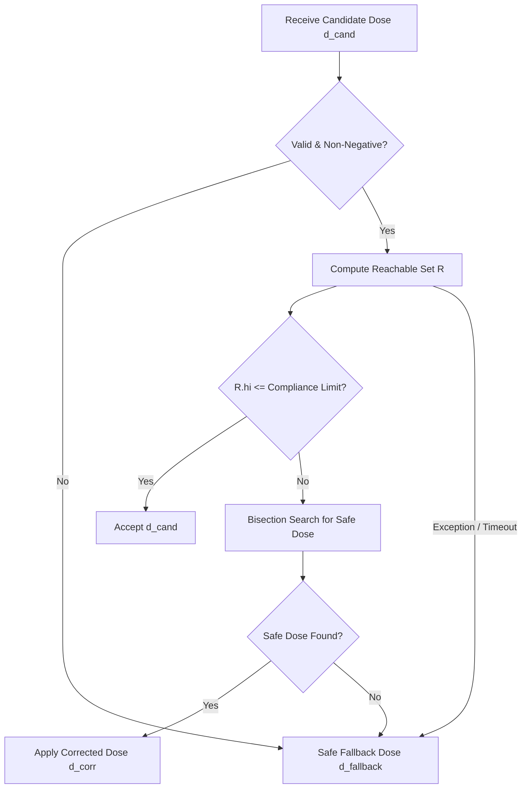

# Formal Reachability Analysis Methodology

This document details the mathematical formulation, interval arithmetic mechanics, reachability propagation, conservativeness guarantees, and known limitations of the **`certified-dose`** formal safety layer.

---

## 1. Motivation and Problem Formulation

In automated chemical dosing (such as coagulant dosing for coagulation-flocculation in drinking water or municipal wastewater treatment), an automated agent selects a dosing setpoint $d_t \in \mathbb{R}_{\ge 0}$ at each control epoch $t$.

The physical plant dynamics are governed by a nonlinear process relation:

$$
y_t = f(d_t, \theta_t)
$$

where:
- $y_t \in \mathbb{R}$ is the output performance variable (e.g., effluent turbidity in Nephelometric Turbidity Units, NTU).
- $d_t$ is the applied chemical dose (e.g., coagulant dose in mg/L).
- $\theta_t \in \mathbb{R}^m$ is an environmental disturbance vector representing influent water characteristics (influent turbidity $`T_{\text{in}}`$, flow rate $Q$, $\text{pH}$, temperature $T$).

Regulatory agencies (e.g., EPA, WHO, state authorities) mandate a strict ceiling on effluent turbidity:

$$
y_t \le L_{\text{compliance}} \quad (\text{e.g., } 1.0 \text{ NTU})
$$

Standard machine learning (ML) controllers (reinforcement learning, gradient boosted regression, neural networks) optimize an objective such as:

$$
\min_{d_t} \mathbb{E}_{\theta \sim \mathcal{D}} \left[ \text{Cost}(d_t) + \lambda \cdot \ell(y_t) \right]
$$

Because ML controllers optimize expected (average) values, they offer **no worst-case safety guarantees**. If an unexpected disturbance realization $`\theta^{\star} \in \Theta`$ occurs, an aggressive controller that minimized chemical dosage to shave cost will fail to destabilize colloidal particles, resulting in severe compliance violations.

`certified-dose` solves this by introducing a formal reachability certification layer between the candidate controller and the plant actuator.

---

## 2. Bounded Disturbance Uncertainty Sets

Rather than assuming exact point measurements, sensors provide bounded uncertainty sets capturing measurement noise, sensor drift, and process volatility over the control horizon:

$$\Theta = \left\{ \theta \in \mathbb{R}^m \;\middle|\; \underline{\theta}_i \le \theta_i \le \overline{\theta}_i, \quad i = 1, \dots, m \right\}$$

For our wastewater treatment application:
- Influent turbidity: $T_{in} \in [\underline{T}_{in}, \overline{T}_{in}]$
- Hydraulic flow rate: $Q \in [\underline{Q}, \overline{Q}]$
- Water pH: $pH \in [\underline{pH}, \overline{pH}]$
- Temperature: $T \in [\underline{T}, \overline{T}]$

---

## 3. Rigorous Interval Arithmetic

Interval arithmetic defines operations on closed connected sets of real numbers $X = [\underline{x}, \overline{x}]$, where $\underline{x} \le \overline{x}$.

### 3.1 Elementary Operators

Let $X = [\underline{x}, \overline{x}]$ and $Y = [\underline{y}, \overline{y}]$. The fundamental arithmetic operations are defined such that:

$$X \circ Y = \{ x \circ y \mid x \in X, y \in Y \}$$

Specifically:
- **Addition**: $`X + Y = [\underline{x} + \underline{y}, \; \overline{x} + \overline{y}]`$
- **Negation**: $`-X = [-\overline{x}, \; -\underline{x}]`$
- **Subtraction**: $`X - Y = X + (-Y) = [\underline{x} - \overline{y}, \; \overline{x} - \underline{y}]`$
- **Multiplication**: $`X \times Y = [\min(P), \; \max(P)]`$ where $P = \{ \underline{x}\underline{y}, \underline{x}\overline{y}, \overline{x}\underline{y}, \overline{x}\overline{y} \}$
- **Reciprocal** (provided $0 \notin Y$): $`Y^{-1} = \left[ \frac{1}{\overline{y}}, \; \frac{1}{\underline{y}} \right]`$
- **Division** (provided $0 \notin Y$): $`X / Y = X \times Y^{-1}`$

### 3.2 Monotonic Functions

For any strictly continuous and monotonic function $g: \mathbb{R} \to \mathbb{R}$:

If $g$ is monotonically non-decreasing (e.g., $e^x, \sqrt{x}$ for $x \ge 0$, $x^p$ for $p > 0$):

$$
g(X) = [g(\underline{x}), \; g(\overline{x})]
$$

If $g$ is monotonically non-increasing (e.g., $e^{-x}, 1/x$ for $x > 0$):

$$
g(X) = [g(\overline{x}), \; g(\underline{x})]
$$

---

## 4. First-Order Affine Arithmetic

Standard interval arithmetic suffers from the **dependency problem** (loss of correlation between repeated occurrences of identical variables). For example, if $X = [1, 3]$:

$$X - X = [1 - 3, 3 - 1] = [-2, 2] \ne [0, 0]$$

To alleviate this over-conservatism, `certified-dose` includes an implementation of **Affine Arithmetic (AA)**. An uncertain quantity $\hat{x}$ is represented as an affine form:

$$\hat{x} = x_0 + \sum_{i=1}^n x_i \epsilon_i + r_x \epsilon_r$$

where:
- $x_0 \in \mathbb{R}$ is the central value.
- $\epsilon_i \in [-1, 1]$ are independent, shared noise symbols representing uncertainty sources.
- $x_i \in \mathbb{R}$ are partial deviations indicating sensitivity to noise symbol $i$.
- $r_x \ge 0$ is the accumulated non-linear approximation radius.

Affine operations maintain shared dependencies:

$$\hat{x} - \hat{x} = (x_0 - x_0) + \sum_{i=1}^n (x_i - x_i)\epsilon_i = 0$$

Nonlinear multiplications are linearized around the central point with conservative bounding of second-order Taylor residuals added to $r_x$:

$$\hat{x} \hat{y} = x_0 y_0 + \sum_{i=1}^n (x_0 y_i + y_0 x_i)\epsilon_i + \text{Rad}(\hat{x})\text{Rad}(\hat{y})\epsilon_{new}$$

The bounding interval is recovered directly:

$$\text{Interval}(\hat{x}) = \left[ x_0 - \sum |x_i| - r_x, \; x_0 + \sum |x_i| + r_x \right]$$

---

## 5. Forward Reachability Propagation

Given a proposed coagulant dose $d$ and the disturbance interval box $\Theta = [T_{in}] \times [Q] \times [pH] \times [T]$, the reachability engine propagates the set through the nonlinear kinetics:

$$T_{eff} = f(d, T_{in}, Q, pH, T)$$

Our synthetic process model accounts for two competing physical phenomena:

#### 1. Colloidal Destabilization & Sedimentation Removal

$$
T_{\text{rem}} = T_{\text{floor}} + \frac{T_{\text{in}} - T_{\text{floor}}}{1 + c_1 \cdot \frac{d^{1.6}}{\phi(\text{pH}, T)}}
$$

where $\phi(\text{pH}, T) = (1 + 0.015(T_{\text{nom}} - T)) \cdot (1 + 0.20(\text{pH} - \text{pH}_{\text{opt}})^2)$.

#### 2. Restabilization & Carryover (Over-dosing)

$$
T_{\text{over}} = c_2 \cdot d^{2.1} \cdot \left(\frac{Q}{Q_{\text{nom}}}\right)^{0.85} \cdot (1 + 0.20(\text{pH} - \text{pH}_{\text{opt}})^2)
$$

Total effluent turbidity:

$$
T_{\text{eff}} = T_{\text{rem}} + T_{\text{over}}
$$

### Inclusion Monotonicity Proof

By the fundamental theorem of interval arithmetic (**Inclusion Monotonicity**):

$$
\forall \theta \in \Theta, \quad f(d, \theta) \in \left[ f \right]\left(d, \Theta\right) = [T_{\text{eff}}^{\min}, T_{\text{eff}}^{\max}]
$$

Because each uncertain variable ($T_{\text{in}}, Q, \text{pH}, T$) appears with clean monotonic properties within the sub-expressions, evaluating $`\left[ f \right]\left(d, \Theta\right)`$ via our `Interval` implementation yields a **provably conservative enclosing set** containing all possible effluent realizations.

### Safety Margin Widening

To account for machine floating-point rounding errors and potential unmodeled discretization tolerances, the reachability engine expands the upper bound by an additive margin $`\delta_{\text{margin}} \ge 0`$:

$$
\overline{\mathcal{R}}(d) = [T_{\text{eff}}^{\min}, \; T_{\text{eff}}^{\max} + \delta_{\text{margin}}]
$$

---

## 6. Certification and Fail-Safe Fallback Logic

The safety wrapper executes the following verification pipeline for any candidate dose $d_{\text{cand}}$:

#### 1. Acceptance Criterion
If $`\sup \overline{\mathcal{R}}(d_{\text{cand}}) \le L_{\text{compliance}}`$, the candidate dose is **ACCEPTED**.

#### 2. Bisection Search for Correction
If the candidate dose breaches the limit, a bounded bisection search across the admissible range $`[d_{\min}, d_{\max}]`$ identifies the lowest dose $`d_{\text{corr}}`$ such that:

$$
\sup \overline{\mathcal{R}}(d_{\text{corr}}) \le L_{\text{compliance}}
$$

The action is tagged as **REJECTED_CORRECTED**.

#### 3. Strict Fail-Safe Invariant
If no safe dose exists in the search domain (e.g. extreme storm surge), or if **ANY** numerical error, domain error, or NaN is detected, the certifier immediately falls back to a pre-computed safe dose $`d_{\text{fallback}}`$.
**Under no circumstances is an unverified dose permitted to pass through.**

---

## 7. Known Limitations and Conservativeness Trade-offs

1. **Over-Approximation and the Wrapping Effect**:
   Interval arithmetic always over-approximates the true reachable set ($\mathcal{R}_{\text{true}} \subseteq \mathcal{R}_{\text{computed}}$). While this ensures safety (zero false negatives), wide disturbance intervals can result in overly conservative rejections (false positives), requiring higher doses than strictly necessary.
2. **Synthetic Model Assumptions**:
   The process model is synthetic and reflects qualitative coagulation kinetics. Real-world wastewater reactors exhibit spatial gradients, hydraulic dead-zones, floc break-up, and non-instantaneous mixing kinetics.
3. **Sensor Faults vs. Uncertainty**:
   The safety layer assumes sensor errors remain within the specified interval $[\underline{\theta}, \overline{\theta}]$. Sensor freezing, bias drift exceeding the interval, or physical sensor failure must be addressed via separate hardware redundancy / fault detection systems.
